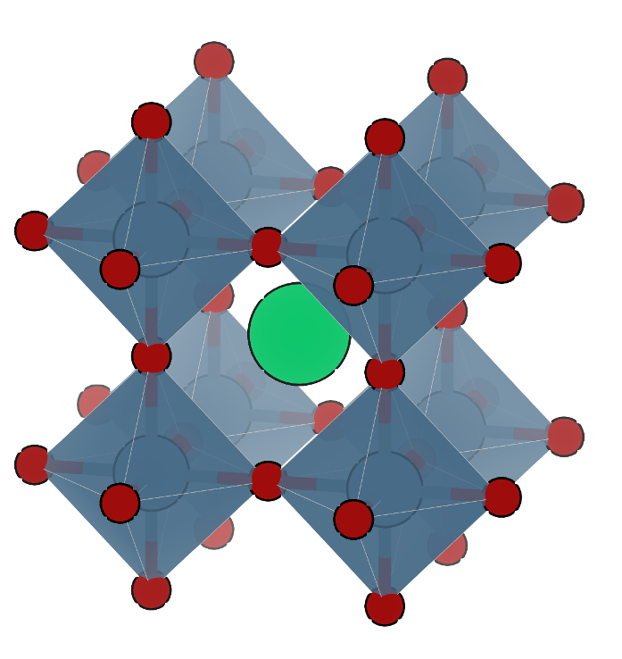

### Low frequency oscillations and highly disordered molecules
###### The role of entropy in phase transitions of hybrid organic-inorganic materials

 Keith T. Butler

---
### Perovskites

* Chemical formula: $ABX_3$

 

---
### Hybrid perovskites

* Replace $A$ with a molecule 

 

---
### Hybrid perovskite PV

* Perovskite cells are cheap to produce cdsj 

 
---
### The problem with perovskites

* Inherent instability

 

    * Water
    * Oxygen
    * Light!!
---

### Flux Design

$$\Delta G = \Delta U$$
---

