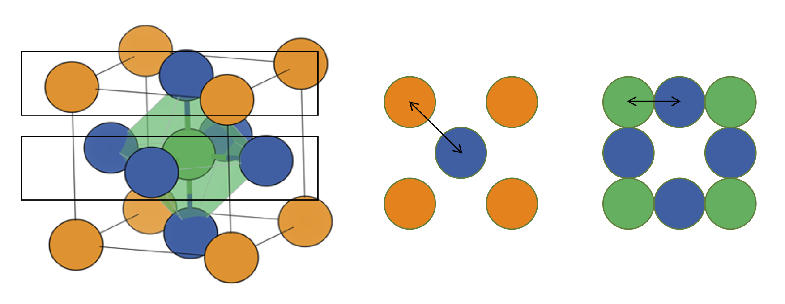

### Low frequency oscillations and highly disordered molecules
###### The role of entropy in phase transitions of hybrid organic-inorganic materials

 Keith T. Butler

---
### Perovskites

* Chemical formula: $ABX_3$

 

---
### Hybrid perovskites

* Replace $A$ with a molecule 

 

---
### Hybrid perovskite PV

* Perovskite cells are cheap to produce 

---
### The problem with perovskites

* Inherent instability
    *  Water 
    *  Oxygen 
    *  Light!! 

 

<small> Butler, *Nano Lett.*, **2014**, 14, 2584</small>

---
### Designing new perovskites

* Goldschmidt tolerance factor gives a design principle
    * Rigid body appraoch
    * Derived for inorganic oxide perovskites

 

$$TF = \frac{r_a + r_x}{\sqrt{2} (r_b + r_x)}$$

<small> *Die Naturwissenschaften*, **1926**, 21, 477</small>
---
### Tolerance Factors in hybrids

* Define an effective radius for molecules

 

* Approach seems to work quite well for many systems

<small> *Chem. Sci.*, **2014**, 5, 4712</small>
---
### Formate perovskites

 

<small> Butler, *Chem. Comm.*, **2015**, 51, 15538</small>
---
### Formate perovskites

 

* Structures do not follow the Goldschmidt predictions

<small> Butler, *Chem. Comm.*, **2015**, 51, 15538</small>
---
### Formate perovskites

 

* DFT energies do not match experiment
* $$\Delta G = \Delta U + pV + T \Delta S$$ |
* $$\Delta G \simeq \Delta U$$ |
---

### Flux Design

$$\Delta G = \Delta U$$
---

