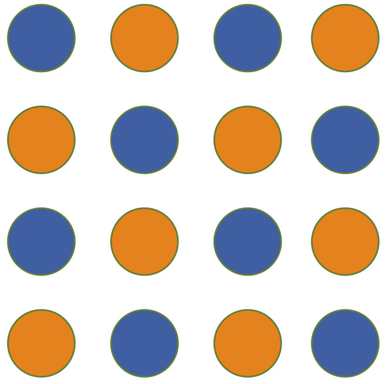
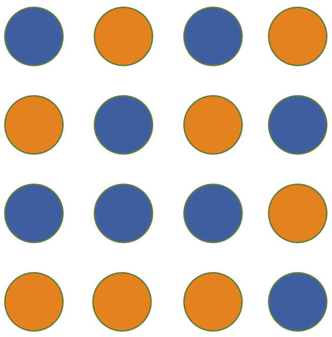

| Tables        | Are           |
| ------------- |:-------------:|
|  | |

 Tables        | Are           | Tables        | Are           
 ------------- |:-------------:| ------------- |:-------------:
 |0 |1  |0 
  | 0 | 1 | $k_B \ln(6)$ 
 